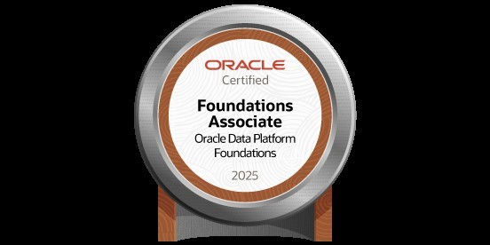

# 👋 Hi, I'm Anup Chapain  

Welcome to my corner of GitHub!  
I’m passionate about **Cloud Infrastructure, Python, Linux, networking, server administration, and automation**, and I’m continuously learning by building small but meaningful projects.
This is my documentation of learning towards my long term career goal of becoming a dependable DevOps engineer who is not completely replacable by AI very soon. ;)

---

## 🌱 What I'm Learning
- Linux fundamentals, shell scripting, and server management  
- Docker & containerization (currently experimenting with self-contained apps)  
- Networking tools, DNS diagnostics, and troubleshooting  
- Git/GitHub workflows for real-world projects  

---

## 🏅 Certifications

### 🧠 Oracle Cloud Infrastructure 2025 Certified Foundations Associate
### 🧠 Oracle Cloud Infrastructure 2025 Certified AI Foundations Associate
### 🧠 Oracle Data Platform 2025 Certified Foundations Associate
   

---

## 🛠️ Some Projects & Experiments

### 🔹 [Real-Time Face Blur with GPU Acceleration + Virtual Webcam](https://github.com/fitandfine/faceblur)
> Python app that detects faces in real time and applies automatic blurring for **privacy protection** in calls or streams.  
- GPU-accelerated with PyTorch + CUDA  
- Falls back to CPU gracefully  
- Potential application in privacy tools & compliance  

### 🔹 [Always-On DNS Tracker](https://github.com/fitandfine/linux-scripting-repo/blob/main/scripts/dns_tracker.sh)
> Bash script to monitor DNS queries with **live logging**, auto-start at boot, and silent background mode.  
- Uses colored real-time output for clarity  
- Helps with **network diagnostics** and security monitoring  

### 🔹 [Interactive Dictionary App](https://github.com/fitandfine/dictionary)
> JavaScript-based dictionary app that responds to **double-click word lookups**.  
- Handles punctuation gracefully  
- Great for quick learning & productivity  

### 🔹 [Dockerized Roster Builder](https://github.com/fitandfine/BP_Roster)
> Notes and scripts to set up first docker container.  
- Written in Python  
- Useful as a **self-study guide** for Docker

### 🔹 [DNS Inspector Pro - GUI](https://github.com/fitandfine/dnsinspect)
> Inspect all major DNS record types: A, AAAA, CNAME, MX, NS, SOA, TXT, CAA.
- Written in Python ( Tkinter, dnspython , filedialog & messagebox ) 
- Bulk domain inspection with live progress updates.
---

## ⚡ Skills in Progress
- **Linux**: file system, process management, permissions, and networking.
- **Bash scripting**: automation of everyday tasks.
- **Docker**: containerized workflows.
- **Networking & DNS**: diagnostic tools (dig, nslookup, traceroute, tcpdump, etc.)
- **Python**: With the view to leveraging power of AI for future projects.
- **Cloud**: Preparing for Oracle Cloud Infrastructure Architect Associate.
- **Markdown & Documentation**: clear and thorough project docs.

---

## 📈 Current Focus
- Practicing **server administration** on Raspberry Pi  
- Simulating real-world **tech support & DevOps** scenarios  
- Building a habit of documenting everything I learn  

---

## 🌍 Connect
- 💼 Open to entry-level roles in **technical support, Linux administration, or DevOps**  
- ✉️ Reach me here on GitHub discussions or issues  
---

⭐ If you find my projects helpful, feel free to **star** them or suggest improvements — I’m always eager to learn more!  
